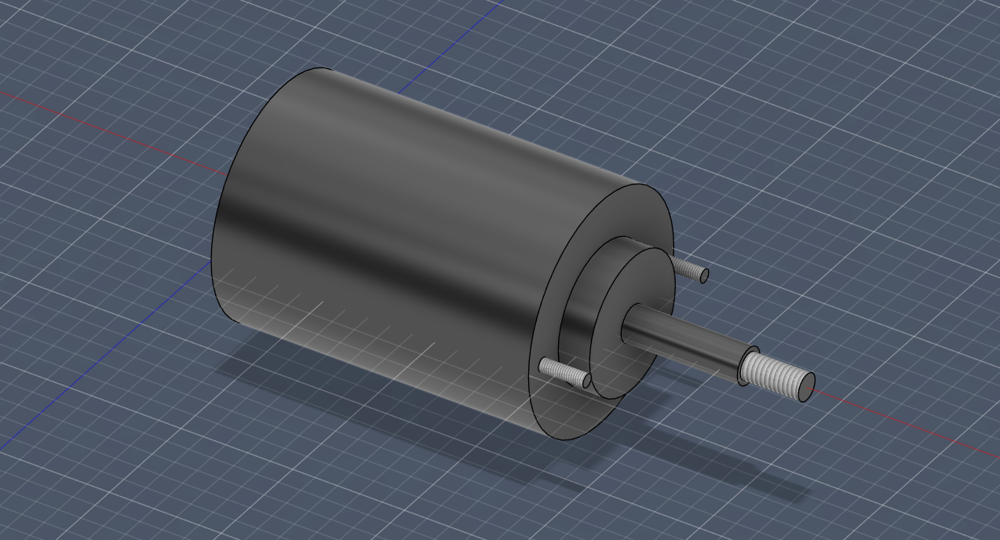
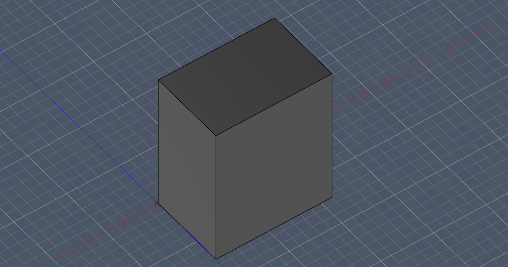
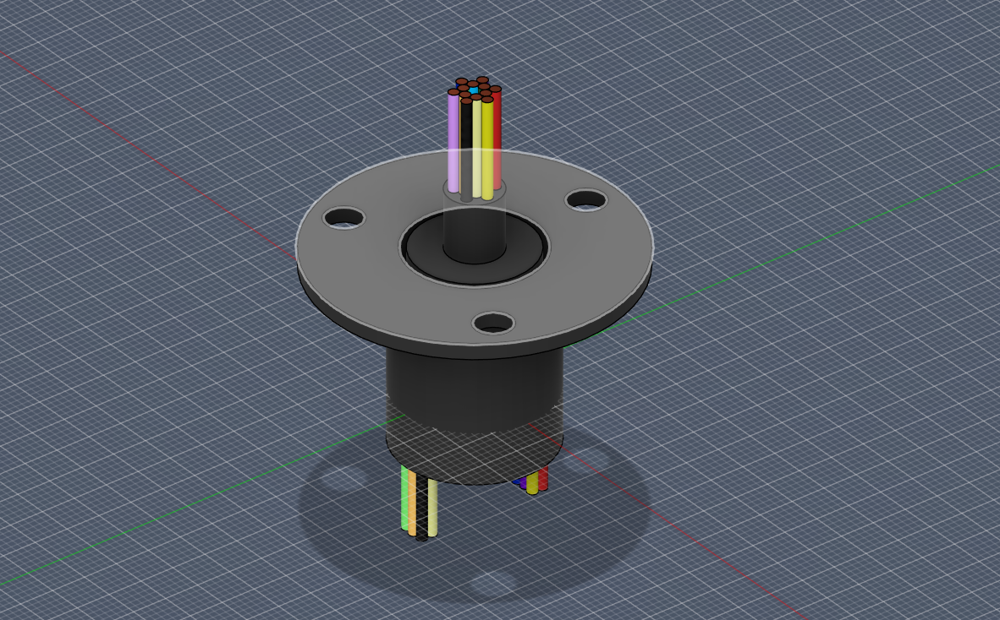
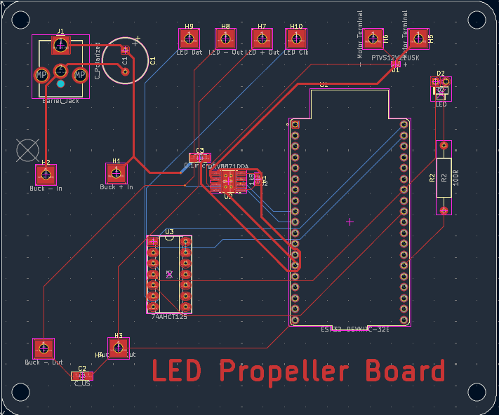
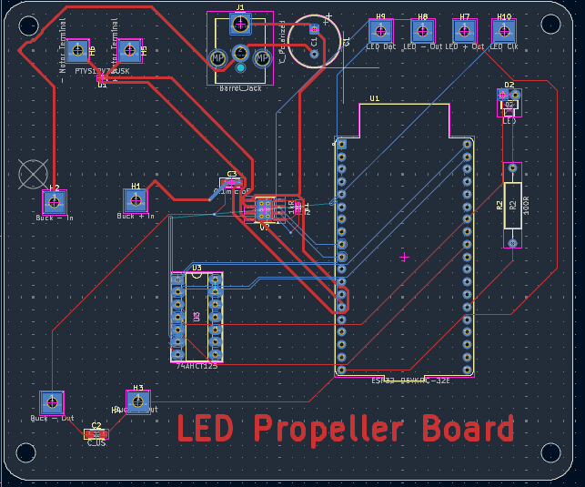
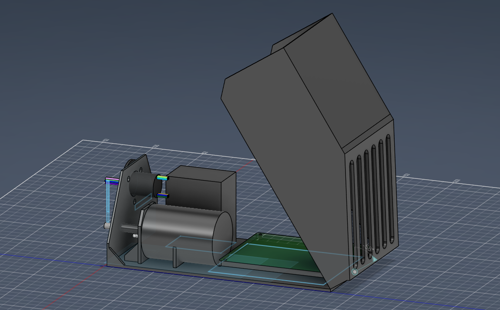
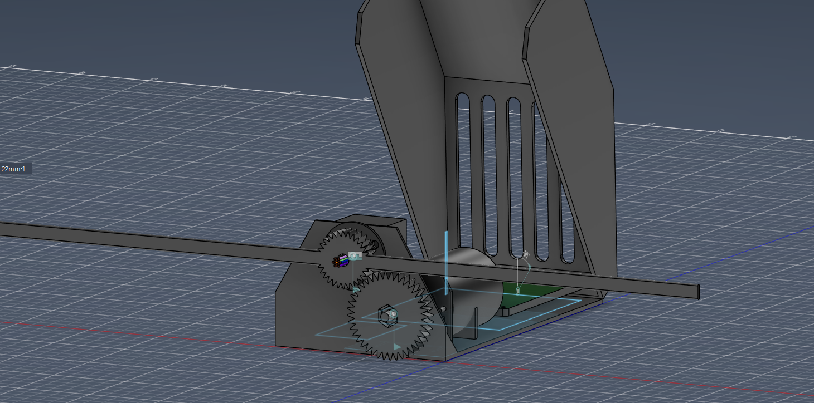
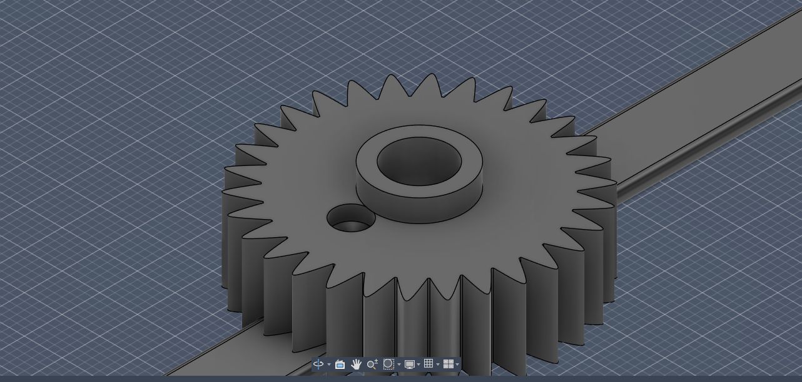

# Journal

## June 11 2026

### Research (1hr 42min)

https://www.youtube.com/watch?v=GS9G-EpY_SY (Not included in time spent researching)

This video was helpful to calculate the speed and size of the LED and understanding the persistance of vision effect.

_The calculations for the speed of the fan are in the [README.md](README.md)._

https://learn.adafruit.com/motorized-pov-led-display

This guide from adafruit explained how a slip ring can be used to wire a rotating component to a stationary one without wires crossing over/damaging. Their [DotStar LED Strip](https://www.adafruit.com/product/2328) has a LED density and refresh rate that fits this projects criteria.

[DotStar LED Strip](https://www.adafruit.com/product/2328):
32 MHz clock rate > 3200 Hz required for 64 columns at 3000 RPM.

_The calculations for the clock rate of the LED strip are in the [README.md](README.md)._

144 LEDs / 2 propellers = 72 columns > 64 columns required.

144 x 144 image is 20736 bits. 3000 RPM = 50 RPS.
$ 20736 \* 50 = 1036800 $ bits per second or 1.0368 Mbps.

Looking at the ESP32 microcontroller's Wifi capabilities, it can support up to 150 Mbps so it seems to be the ideal microcontroller for this project.

### CAD Design (2hr 7min)

I worked on the chassis design that will hold all of the electronics. I spent the majority of this time on modeling dimension-accurate models of the motor, battery and slip ring in order to get the dimensions right for the chassis.

**Motor**

**Battery**

**Slip Ring**
_Slightly edited version of [this model](https://learn.adafruit.com/motorized-pov-led-display/cad-files) from Adafruit_

I started with a sketch on paper to get a rough idea of the design and dimensions of the chassis.
I decided on an openable design that can be easily assembled and disassembled for maintenance and repairs. I made the motor mount on the chasis and plan to fit the rest of the components into the design tomorrow.

## June 12 2026

### CAD Design (1hr 30min)

I continued working on the chassis design and added the mounts for the battery and slip ring. I also added holes for the wires to pass through and a hole on the outside of the chassis for the motor axle to pass through. The dimensions for the motor are in the amazon listing in a line drawing/sketch.

### PCB Design (1hr 57min)

I started designing the PCB for the project. I used the [ESP32 DevKitC](https://www.espressif.com/en/products/devkits/esp32-devkitc) as the microcontroller for this project and added the necessary components for power regulation and LED control. I choose to use the devboard directly on the PCB so that a usb - uart port did not need to be added manually to the PCB. (The devbooard has a built in microusb port. I added all other components like

## June 13 2026

### PCB Design (3hr 2min)

I continued working on the pcb finishing the schematic & PCB with all components. I added a buck converter to step down the 12V from the battery to 5V for the ESP32 and LED strip. I used a Bus Buffer Gate to change the ESP32's 3.3V signal to a 5V signal for the LED strip. There is a led status indicator on the board to be programmed later.

### Research (49min)

The majority of this time was spent looking at datasheets to ensure compatibity. I had an especially hard time deciding on which motor driver to use, because many IC's have different peak current draws and need active cooling which would add complexity to the design.

## June 15 2026

### PCB Design (1hr 16min)

Had to redesign the PCB becuaae its position in the chassis had to change and the direction of the motor, battery, and led wires had to change.

### CAD Design (1hr 30min)

Added walls to the chassis and added the gear system to connect the motor to the propeller. I also added a mount for the slip ring. The pcb is raised off the base of the chassis to allow for better airflow and cooling. There are screw holes to hold the pcb.

## June 17 2026

### CAD Design (1hr 44min)

Finished the hull that should slide ontop of the base of the chassis. 

Made airholes on the hull to allow for better cooling. 

## June 18 2026

### CAD Design (56min)

I made the fan and some prototype gears for the motor and fan. I used prototype gears because I want to use premade from a hobby store to maximize the efficiency and durability of the system.

Printing the fan horizontally maximizes the tension the blades can withstand, and since centrifugal force will be pushing the blades outward, this is the ideal orientation.

## June 19 2026

### CAD Design (20min)

Made a small hole for a hall effect sensor to be placed on the motor mount to measure the RPM of the motor. This will be used to synchronize the LED display with the rotation of the fan. Also made a mount for the small permanent magnet on the rotating shaft.

